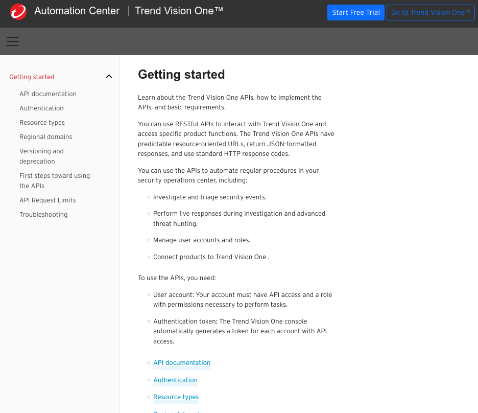

At Trend Micro, I contributed to the Automation Center (https://automation.trendmicro.com/xdr/home/), the documentation repository for Trend Vision One APIs. This platform provides developers with:

- Automation Guides: Step-by-step instructions for automating endpoint protection and implementing detection and response flows.
- API Reference Catalog: An interactive catalog detailing Trend Vision One APIs, allowing users to understand request and response schemas for seamless integration.
- API Cookbook: A collection of practical examples and templates for various API versions (e.g., v2.0, v3.0).

## My contributions

- Style Guide: I defined and implemented the style guide for all Automation Center documentation, ensuring consistency in voice and terminology.
- Established Review SOP: I created a new Standard Operating Procedure (SOP) for documentation reviews, designed to:
  - Align with product development speeds and practices.
  - Be familiar to developers.
  - Enable the technical writing team to respond efficiently to required documentation changes.
- Ensured Documentation Quality: Reviewed and edited all guides, cookbooks, and API reference documentation to align with the style guide and ensure clarity and accuracy.

**Tools used**: Markdown, Git, Swagger UI
