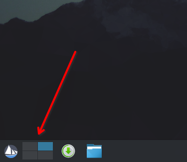

1. In the [System Settings](../open-system-settings) screen, go to **Workspace** > **Workspace Behavior** > **Virtual Desktops**.
2. Define the number of rows in the grid.
3. Create a new virtual desktop.
   - Click **Add**.
   - (Optional) Click the **Rename** button to change the name of the virtual desktop.
4. Repeat the previous step to add multiple virtual desktops.



5. (Optional) Configure the behavior of the virtual desktops.
   - **Navigation wraps around**: Lets you cycle through your virtual desktops in a loop using keyboard shortcuts or mouse gestures.
   - **Show animation when switching**: Displays animations when switching between virtual desktops.
   - **Show on-screen display when switching**: Displays the name of the current desktop when switching between desktops.
   - **Show desktop layout indicators**: Displays the virtual desktop grid when you switch between desktops.

6. Click **Apply**.

